## Introduction

- Norovirus is an important cause of viral gastroenteritis worldwide
- Case reports are increasing, and new strains - often recombinants - emerging
  - How do recombinants emerge, when the infection is acute and associated with aggressive symptoms?
- Outbreaks are seasonal, but no non-human reservoir
  - How does norovirus persist over the summer?

---

## Outline:

- Genotyping of norovirus and recombination
  - Old work, in need of updating
- The hospital setting as a crucible for new strains
  - Work in progress

---

## Genotyping

- Many viruses are divided into genotypes
  - e.g. Norovirus is divided into several genogroups, genotypes, and clusters
      - GI, GII, GIII, GIV
      - GII.3, GII.4, etc.

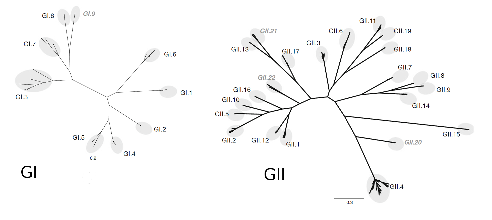
<div style="font-size:20px">Kroneman et al. Arch. Virol (2013)</div>

---

## Noronet typing

- Genogroup assignment using BLAST against a reference set of enterovirus genomes
- If Norovirus GI or GII, and there is overlap (>100nt) with regions used for genotyping
  - Phylogenetic trees are built using reference alignments of ORF1 and ORF2
  - Further fine-scale genotyping of GII.4 strains
- Recombination is only detected between ORF1 and ORF2, by a discordant genotype

---

## Issues with Norovirus genotyping

- Recombination may occur within ORFs
- Genotype assignment is on the basis of clustering with reference strains
  - What if the sequences cluster with an *ancestor* of the reference strains?
- What if recombination occurs *within* genotypes?
- Methods assume that the reference alignment is free of recombination
  - What if the reference sequences are themselves recombinants?

---

## Subtype Classification using Evolutionary Algorithms

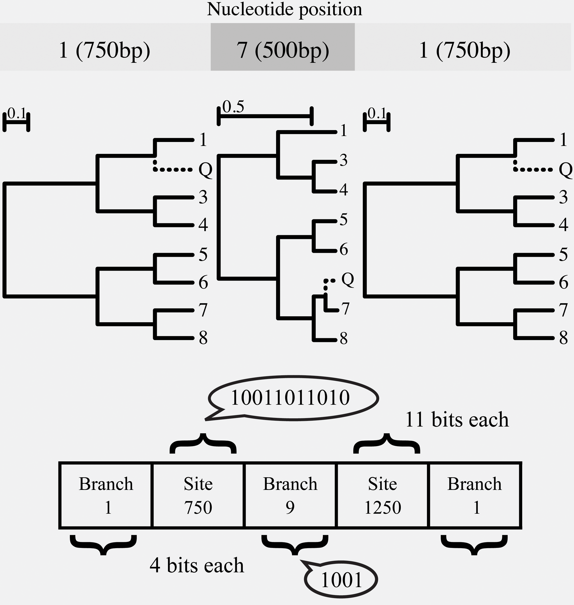
<div style="font-size:20px">Kosakovsky Pond et al. PLoS Comp Biol (2009)</div>

---

## ORF2 II4/II20 recombinants

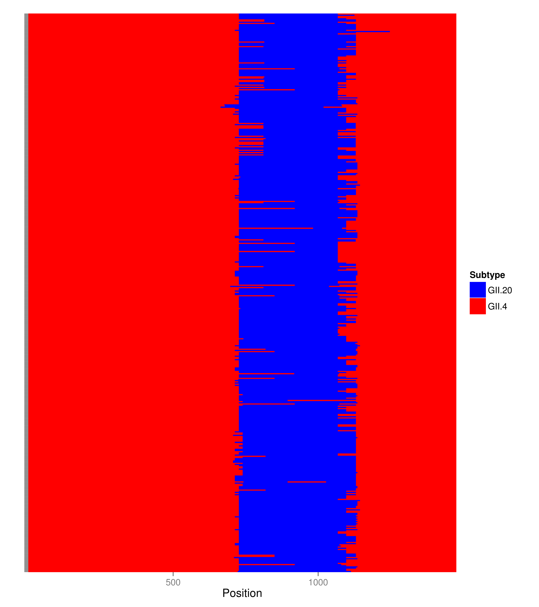

---

## Dynamics of II4/II20 recombinants

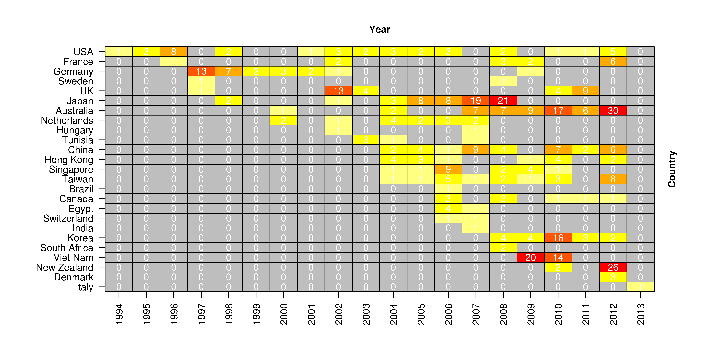

---

## Recombination-free references?

- Reference alignments should be free of recombinant variants
  - If present, recombinant sequences should be split up into non-recombinant segments
- Is there recombination in the Noronet reference alignments?
  - Apparently absent from ORF1, as well as GII.4 ORF1 and ORF2 alignments
- Some indication of recombinants in the ORF2 alignment

---

## Bootscan of GII.10

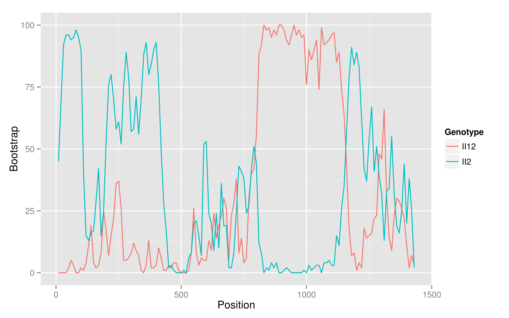

---

## Bootscan of GII.20

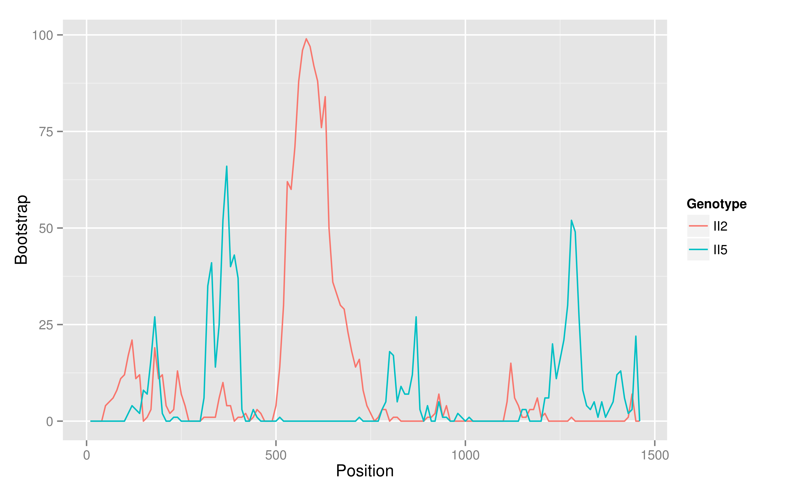

---

## Updates

- The previous analyses conducted on c. 16,000 sequences - now 25,000
- Difficult to work out parental strains
  - Use temporal and spatial information to help resolve
- Recombinants are common, while recombination may not be
- Noronet reference sets have been updated, and the website often breaks
  - Reverse engineering the typing scheme locally

---

## Why so much recombination?

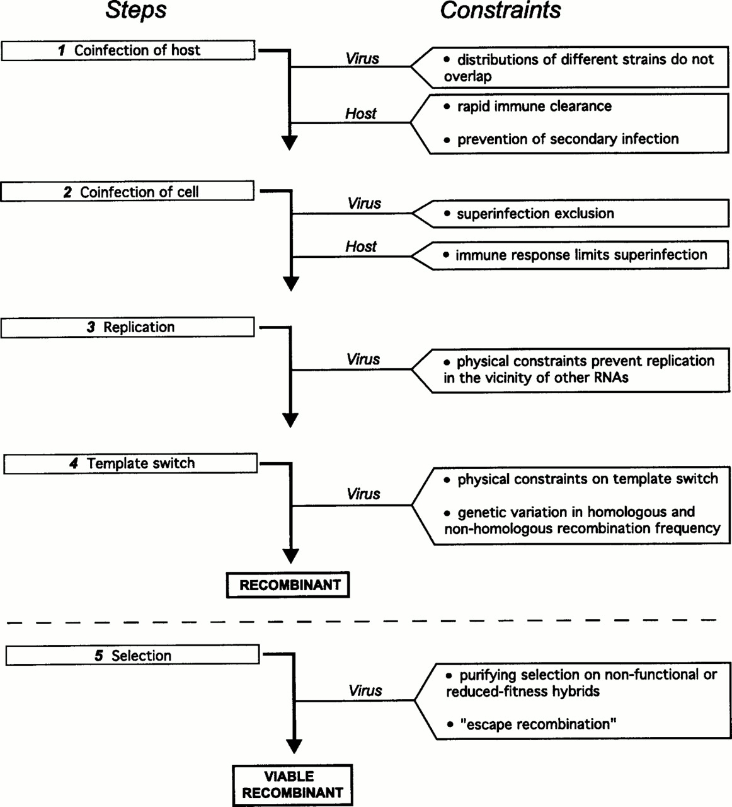
<div style="font-size:20px">Worobey and Holmes J. Gen. Virol. (1999)</div>

---

## Norovirus and chronic infection

- Norovirus may not always be acute
  - Individuals with immunosuppression may become chronically infected
- Infected individuals may continue to transmit
  - Individuals may not always be isolated when sick
  - Asymptomatic individuals

---

## Modeling chronic infection

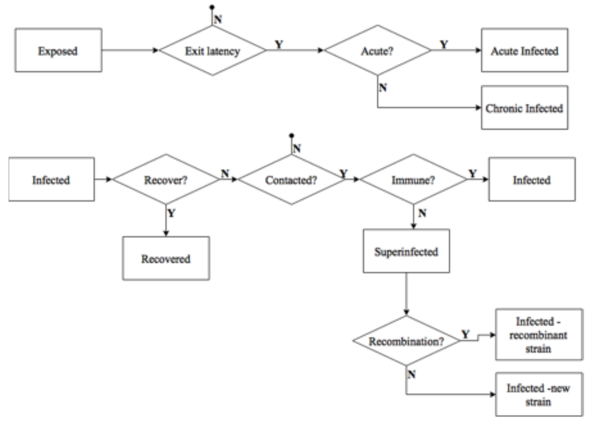

---

## Recombination, chronic infection, and infectivity

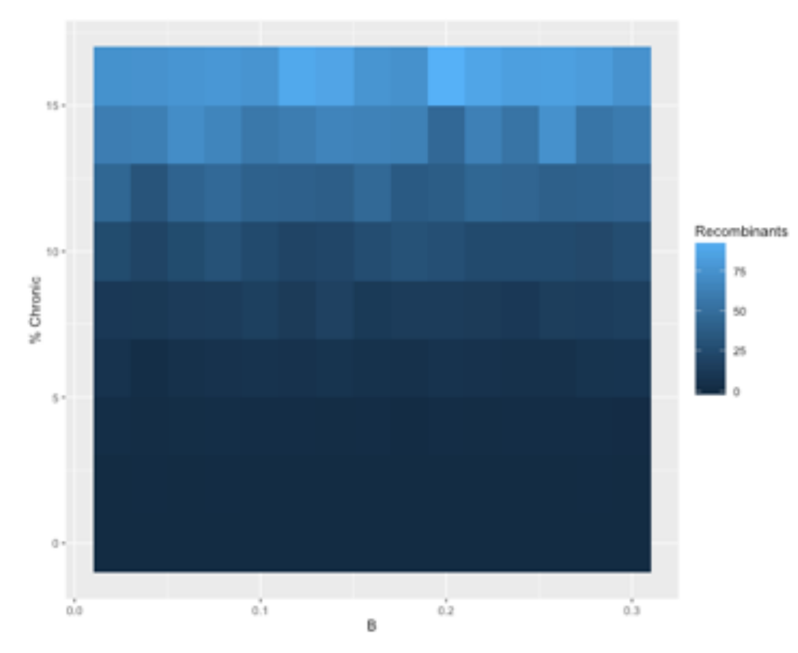

---

## Multiple infections in hospitals?

- One setting where recombinants may emerge is in hospitals
  - Often have outbreaks, with several introductions of different genotypes
  - Immunosuppressed individuals may not control the virus, resulting in chronic infection
- May also play a role in persistance over the summer
  - Magnify a small number of cases
  - Also the potential for asymptomatic healthcare workers to spread infection

---

## Brief protocol

- Faecal samples taken prospectively from patients and healthcare workers (HCWs)
  - Acute and chronic patients
  - Symptomatic and asymptomatic HCWs
- Full genome norovirus sequencing
  - Illumina MiSeq, paired end 2 $\times$ 150bp
  - Near full length genomes in 48/52 samples to date at 250 $\times$ coverage
- Also testing of samples through TaqMan Low Density Arrays (TLDA)

---

## Norovirus prevalence in submitted samples

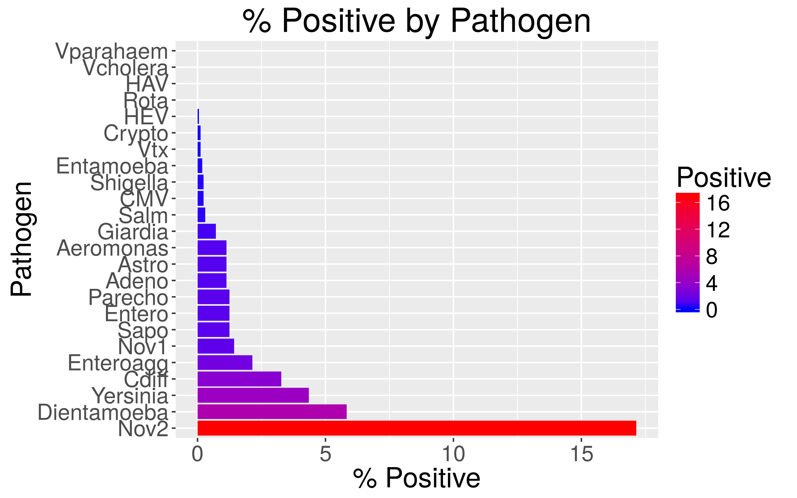

---

## Sequence processing pipeline

- Snakemake based pipeline
  - Remove duplicate reads (```fastuniq```)
  - Trim (```Trimmomatic```)
  - Remove human and bacterial reads (```deconseq```)
  - *De novo assembly* (```iva```)
  - Mapping of reads to contigs (```smalt```)
  - Quasispecies assembly (```QuasiRecomb```)

---

## Previous NGS studies of norovirus

- Wong et al. (2013)
- Cotten et al. (2014)
- Bavelaar et al. (2015)

---

## IVA vs. VICUNA

- Wong et al. (2013) evaluated multiple assemblers (excluding IVA) and concluded that VICUNA gave the best performance
- Based on our samples, VICUNA was much faster than IVA but:
  - Contigs often failed to be typed

---

## Genotypes of baseline, longest contigs: ORF2


---

## GII.17

- 3 patients were infected with GII.17, an emerging clade of Norovirus first reported in Japan
- First report of GII.17 in the UK


---

## GII.4 recombinant

- Wong et al. (2013) reported recombinant viruses, comprising of a GII.4 (New Orleans 2009) ORF1 and a GII.4 (Sydney 2012) ORF2

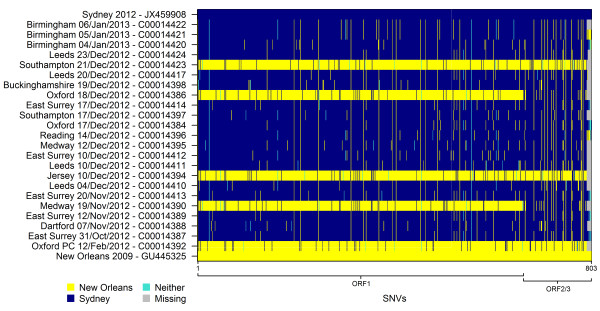

---

## Phylogeny of GII.4 recombinant strain

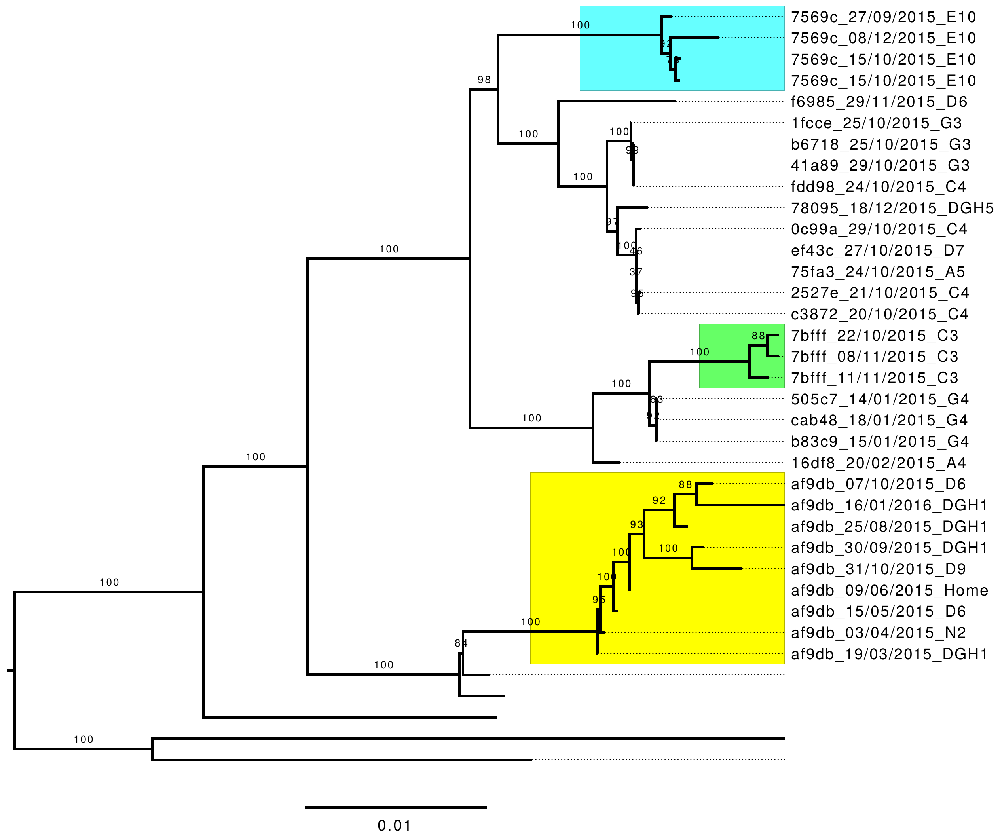

---

## Multiple infections

- Two acute patients sampled from different wards, two weeks apart
  - Major: GII.P4 (New Orleans 2009)/GII.4 (Sydney 2012)
      - Minor: GII.17 (in ORF2)
  - Major: GII.17
      - Minor: GII.4 (Sydney 2012) in ORF2
- Chronic patient infected with two different viruses:
  - Major: GII.P4 (New Orleans 2009)/GII.4 (Sydney 2012)
      - Minor: SaV I (Sapovirus GI.1)
- Chronic patient, sampled from home
  - Major: GII.P4 (New Orleans 2009)/GII.4 (Sydney 2012)
      - Minor: GII.2 (in ORF2)

---

## Coverage in chronic patient

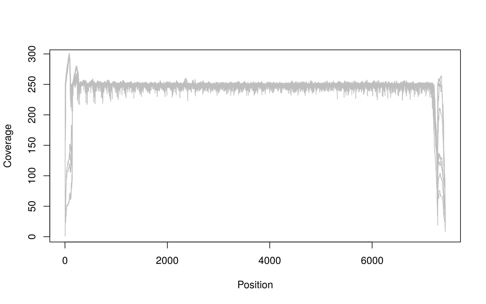


---

## Longitudinal changes in chronic patient

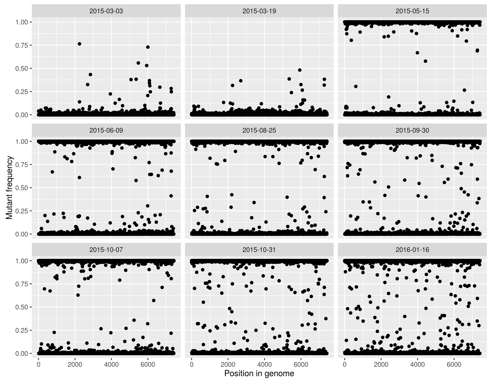

---

## Conclusions

- The hospital setting is a highly dynamic environment of norovirus transmission
- Multiple introductions with multiple subtypes
- Multiple infections
- Chronic infections
- Recombination?

---

## Ongoing work

- Complete GII.17 outbreak
- More chronic patients
- Healthcare workers
- Methodology for mixed infections
  - Detection and genotyping
  - Recombination
  - Linkage to epidemiology

--- ds:yellow

<h2 style="color:#000000">Thanks!</h1>

<br>

<h2>
<span style="font-size:24px"> &nbsp;<a href="mailto:sdwfrost@gmail.com" target="_blank" style="vertical-align:middle">sdwfrost@gmail.com</a></span>
<span style="font-size:24px"> &nbsp;<a href="http://www.twitter.com/sdwfrost" target="_blank" style="vertical-align:middle">@sdwfrost</a></span>
<span style="font-size:24px"> &nbsp;<a href="http://github.com/sdwfrost" target="_blank" style="vertical-align:middle">http://github.com/sdwfrost</a></span>
</h2>


